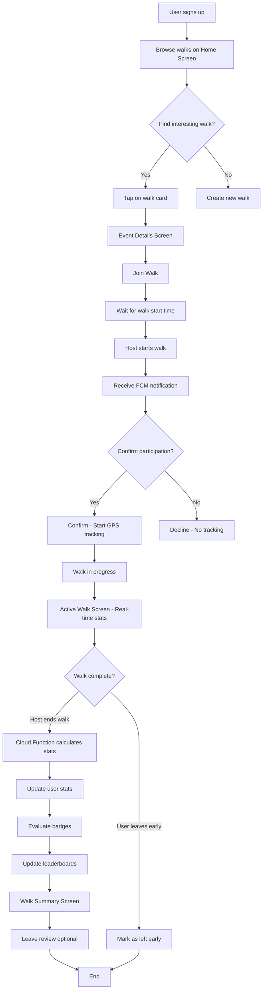

# Yalla Nemshi - Comprehensive Technical Audit
## Production Readiness Assessment & Feature Documentation

**Generated:** January 24, 2026  
**Purpose:** Complete architectural review, bug identification, and production readiness assessment  
**Scope:** Full codebase analysis including Flutter app, Firebase backend, and Cloud Functions

---

## Table of Contents

1. [Executive Summary](#executive-summary)
2. [Architecture Overview](#architecture-overview)
3. [Feature Documentation](#feature-documentation)
4. [Data Models & Relationships](#data-models--relationships)
5. [User Flows](#user-flows)
6. [Critical Issues & Bugs](#critical-issues--bugs)
7. [Security Analysis](#security-analysis)
8. [Performance Concerns](#performance-concerns)
9. [UX Inconsistencies](#ux-inconsistencies)
10. [Recommendations](#recommendations)

---

## 1. Executive Summary

**App Overview:** Yalla Nemshi is a social walking app that enables users to create, discover, and join group walks. It features real-time GPS tracking, social features (friends, chat), gamification (badges, leaderboards), and comprehensive walk management.

**Overall Status:** 🟡 **Near Production Ready** with critical issues requiring attention

### Key Strengths ✅
- Well-structured Flutter architecture with clear separation of concerns
- Comprehensive offline support with caching
- Robust Firebase integration (Firestore, Auth, Functions, Storage, Messaging)
- Feature-complete gamification system (badges, leaderboards, stats)
- Real-time GPS tracking with data persistence
- Rich social features (friends, DM, walk chat)

### Critical Concerns 🐛
1. **Race conditions** in walk state management (start/end walk)
2. **GPS tracking lifecycle issues** with multiple start/stop calls
3. **Firestore security rules** have overly permissive sections
4. **Data consistency problems** between walk participants and GPS tracking
5. **Missing error boundaries** for Cloud Functions
6. **Incomplete offline sync** for pending actions

---

## 2. Architecture Overview

### 2.1 System Architecture

```
┌─────────────────────────────────────────────────────────────┐
│                     FLUTTER CLIENT APP                       │
│  ┌────────────┐  ┌────────────┐  ┌─────────────────────┐  │
│  │  Screens   │  │  Services  │  │  Models/Providers   │  │
│  │  (35+)     │←→│  (30+)     │←→│  (15+ models)       │  │
│  └────────────┘  └────────────┘  └─────────────────────┘  │
│         ↓               ↓                    ↓              │
└─────────┼───────────────┼────────────────────┼──────────────┘
          │               │                    │
          ↓               ↓                    ↓
┌─────────────────────────────────────────────────────────────┐
│                      FIREBASE BACKEND                        │
│  ┌──────────────┐  ┌──────────────┐  ┌──────────────────┐ │
│  │  Firestore   │  │  Auth        │  │  Cloud Functions │ │
│  │  (13 colls)  │  │  (Google)    │  │  (12 functions)  │ │
│  └──────────────┘  └──────────────┘  └──────────────────┘ │
│  ┌──────────────┐  ┌──────────────┐  ┌──────────────────┐ │
│  │  Storage     │  │  Messaging   │  │  Crashlytics     │ │
│  │  (Photos)    │  │  (FCM)       │  │  (Monitoring)    │ │
│  └──────────────┘  └──────────────┘  └──────────────────┘ │
└─────────────────────────────────────────────────────────────┘
```

### 2.2 Core Technology Stack

| Layer | Technologies |
|-------|-------------|
| **Frontend** | Flutter 3.10+, Dart, Riverpod (state management) |
| **Backend** | Firebase (Firestore, Auth, Functions, Storage, FCM) |
| **Maps** | Google Maps Flutter SDK, Geolocator, Geocoding |
| **Notifications** | Firebase Cloud Messaging (FCM), flutter_local_notifications |
| **Offline** | Firestore persistence, SharedPreferences, connectivity_plus |
| **Analytics** | Firebase Crashlytics (error tracking) |

### 2.3 Key Design Patterns

1. **Singleton Services** - All service classes use singleton pattern (e.g., `GPSTrackingService.instance`)
2. **Stream-Based Architecture** - Real-time updates via Firestore streams
3. **Repository Pattern** - Services abstract Firestore operations
4. **Provider Pattern** - Riverpod for state management (auth, theme)
5. **Optimistic Updates** - Offline-first with eventual consistency

---

## 3. Feature Documentation

### 3.1 Authentication & User Management

#### Sign Up Flow
**Files:** [lib/screens/signup_screen.dart](lib/screens/signup_screen.dart), [lib/services/firestore_sync_service.dart](lib/services/firestore_sync_service.dart)

**Features:**
- Email/password registration via Firebase Auth
- Google Sign-In integration (mobile + web)
- Automatic Firestore user profile creation at `/users/{uid}`
- Profile backfill from Google (displayName, photoURL)

**Fields Captured:**
- `uid` (Firebase Auth UID)
- `email` (required)
- `displayName` (from Google or default "User")
- `photoURL` (nullable, from Google profile)
- `createdAt` (server timestamp)

**Logic Flow:**
```
1. User enters email + password (or uses Google Sign-In)
2. FirebaseAuth.createUserWithEmailAndPassword()
3. FirestoreSyncService.syncCurrentUser() 
   → Creates /users/{uid} document if missing
4. Navigate to HomeScreen
```

⚠️ **Issue:** Email validation is basic - doesn't check for disposable emails or verify email ownership until later.

✅ **Good Practice:** Syncs auth state to Firestore automatically in `main.dart` via `FirestoreSyncService.syncCurrentUser()`.

---

### 3.2 Walk Creation & Management

#### Create Walk Screen
**Files:** [lib/screens/create_walk_screen.dart](lib/screens/create_walk_screen.dart), [lib/services/recurring_walk_service.dart](lib/services/recurring_walk_service.dart)

**Walk Types:**
1. **Point-to-Point** - Start and end locations with optional route
2. **Loop** - Single meeting point, returns to origin
3. **Free** - Flexible distance without route

**Key Features:**
- Map-based location picker ([lib/screens/map_pick_screen.dart](lib/screens/map_pick_screen.dart))
- Auto-detect city from GPS coordinates ([lib/services/geocoding_service.dart](lib/services/geocoding_service.dart))
- Photo upload (up to 10 photos, stored in Firebase Storage)
- Tags & metadata (pace, gender, experience level, comfort level)
- **Recurring walks** - Weekly/monthly with end date
- **Private walks** - Invite-only with share codes

**Private Walk Invite System:**
- Generates 6-character alphanumeric code (e.g., "ABC123")
- Codes expire 7 days after creation (configurable in [lib/utils/invite_utils.dart](lib/utils/invite_utils.dart))
- Stored at `/walks/{walkId}/allowed/{uid}` when redeemed
- Share link format: `https://yallanemshi.app/join?w={walkId}&c={shareCode}`

**Data Written to Firestore:**
```dart
{
  'walkType': 'point_to_point' | 'loop',
  'title': string,
  'dateTime': Timestamp,
  'distanceKm': number?,
  'gender': 'Mixed' | 'Women only' | 'Men only',
  'pace': 'Relaxed' | 'Normal' | 'Brisk',
  'hostUid': string,
  'hostName': string,
  'hostPhotoUrl': string?,
  'joinedUserUids': [],
  'joinedCount': 0,
  'visibility': 'open' | 'private',
  'shareCode': string? (if private),
  'shareCodeExpiresAt': Timestamp? (if private),
  'startLat': number?,
  'startLng': number?,
  'endLat': number?,
  'endLng': number?,
  'city': string?,
  'tags': string[],
  'comfortLevel': string,
  'experienceLevel': string,
  'searchKeywords': string[], // for search
  'status': 'scheduled', // initial status
  'cancelled': false,
  'createdAt': serverTimestamp()
}
```

🐛 **Critical Bug - Race Condition in Walk Creation:**
```dart
// In create_walk_screen.dart line ~720
if (isPrivatePointToPoint) {
  final forcedWalkId = _draftWalkId ?? walksCollection.doc().id;
  docRef = walksCollection.doc(forcedWalkId);
  await docRef.set(payload).timeout(const Duration(seconds: 30));
} else {
  docRef = await walksCollection.add(payload).timeout(const Duration(seconds: 30));
}
```
**Issue:** For private walks, the code generates a walk ID early (for invite links) but doesn't verify that ID is actually available. If the same ID is somehow generated twice (extremely rare but possible), the second creation will overwrite the first.

**Fix:** Use Firestore transactions:
```dart
await _firestore.runTransaction((transaction) async {
  final docRef = _firestore.collection('walks').doc(forcedWalkId);
  final snapshot = await transaction.get(docRef);
  if (snapshot.exists) {
    throw Exception('Walk ID collision - regenerate');
  }
  transaction.set(docRef, payload);
});
```

---

### 3.3 Walk Discovery & Search

#### Home Screen Feed
**File:** [lib/screens/home_screen.dart](lib/screens/home_screen.dart)

**Query Logic:**
```dart
Query query = FirebaseFirestore.instance
  .collection('walks')
  .where('cancelled', isEqualTo: false)
  .where('dateTime', isGreaterThan: Timestamp.now())
  .orderBy('dateTime')
  .orderBy('createdAt', descending: true)
  .limit(20);

// City filter (if user has city set)
if (userCity != null) {
  query = query.where(
    Filter.or(
      Filter('city', isEqualTo: userCity),
      Filter('city', isNull: true),
    ),
  );
}
```

**Features:**
- Real-time updates via Firestore snapshots
- City-based filtering (shows local walks + cityless walks)
- Recurring walk collapsing (shows only next instance per series)
- Pagination (load 20 at a time with "Load More" button)
- Offline cache fallback via [lib/services/offline_service.dart](lib/services/offline_service.dart)

**Walk Display Logic:**
```dart
List<WalkEvent> _collapseRecurringWalks(List<WalkEvent> loaded) {
  // Groups walks by recurringGroupId
  // Shows nearest future walk per series
  // Suppresses recurring templates (isRecurringTemplate = true)
  // Keeps standalone walks unchanged
}
```

⚠️ **Performance Issue - Missing Composite Index:**
The city filter with orderBy requires a composite index. First-time users will see this error:
```
FAILED_PRECONDITION: The query requires an index. You can create it here: [link]
```
**Fix:** Pre-create index in `firestore.indexes.json` (currently missing):
```json
{
  "indexes": [
    {
      "collectionGroup": "walks",
      "queryScope": "COLLECTION",
      "fields": [
        {"fieldPath": "city", "order": "ASCENDING"},
        {"fieldPath": "cancelled", "order": "ASCENDING"},
        {"fieldPath": "dateTime", "order": "ASCENDING"},
        {"fieldPath": "createdAt", "order": "DESCENDING"}
      ]
    }
  ]
}
```

#### Advanced Search
**File:** [lib/screens/walk_search_screen.dart](lib/screens/walk_search_screen.dart)

**Filters Available:**
- Date range (from/to)
- Distance range (min/max km)
- Gender preference
- Pace
- Tags (multi-select from predefined list)
- City (text input)

**Search Implementation:**
Uses `searchKeywords` array field for text matching:
```dart
searchKeywords: [
  title.toLowerCase().split(),
  description.toLowerCase().split(),
  city.toLowerCase(),
  tags.map(t => t.toLowerCase()),
  // etc.
]
```

⚠️ **Limitation:** Full-text search is basic. Firestore doesn't support fuzzy matching or typo tolerance. Consider Algolia for production.

---

### 3.4 Join Walk & Participation

#### Join Flow
**Files:** [lib/screens/event_details_screen.dart](lib/screens/event_details_screen.dart), [lib/services/walk_history_service.dart](lib/services/walk_history_service.dart)

**Process:**
1. User taps "Join Walk" button on event details
2. Writes to `/users/{uid}/walks/{walkId}`:
   ```dart
   {
     'userId': uid,
     'walkId': walkId,
     'joinedAt': Timestamp.now(),
     'status': 'open',
     'participationState': 'joined',
     'completed': false
   }
   ```
3. Updates walk document:
   ```dart
   {
     'joinedUserUids': FieldValue.arrayUnion([uid]),
     'joinedUserPhotoUrls': FieldValue.arrayUnion([photoUrl]),
     'joinedCount': FieldValue.increment(1),
     'participantStates.{uid}': 'joined'
   }
   ```
4. Cloud Function `onWalkJoined` sends FCM notification to host

**Participant States:**
- `joined` - User has joined, walk hasn't started
- `confirmed` - User confirmed they're walking (after host starts walk)
- `left` - User left the walk early
- `declined` - User declined to participate when prompted
- `completed` - Walk finished, user completed it

🐛 **Bug - Participant State Desync:**
The `participantStates` map on the walk document and the user's `/users/{uid}/walks/{walkId}` record can get out of sync if one update fails:

```dart
// In walk_history_service.dart
await _firestore.collection('users').doc(uid).collection('walks').doc(walkId).set(...);
// ⬆️ This succeeds

await _firestore.collection('walks').doc(walkId).update({
  'participantStates.$uid': 'joined'
});
// ⬆️ This could fail (permissions, network, etc.)
// Result: User thinks they joined, but walk doc doesn't reflect it
```

**Fix:** Use Firestore batch writes:
```dart
final batch = _firestore.batch();
batch.set(userWalkRef, participationData);
batch.update(walkRef, {'participantStates.$uid': 'joined'});
await batch.commit(); // Atomic - both succeed or both fail
```

---

### 3.5 Walk Control & Tracking (CP-4)

#### Host Controls - Start Walk
**Files:** [lib/services/walk_control_service.dart](lib/services/walk_control_service.dart), [functions/cp4_walk_completion.js](functions/cp4_walk_completion.js)

**Start Walk Flow:**
```
1. Host presses "Start Walk" (in HomeScreen or EventDetailsScreen)
2. WalkControlService.startWalk(walkId) validates:
   - User is the host (hostUid == currentUid)
   - Walk status == 'scheduled'
   - Current time is within start window:
     - Earliest: 10 minutes before scheduled time
     - Latest: 15 minutes after scheduled time
3. Updates walk document:
   {
     'status': 'active',
     'startedAt': Timestamp.now(),
     'startedByUid': uid,
     'participantStates.{hostUid}': 'confirmed'
   }
4. Cloud Function onWalkStarted triggers:
   - Sends FCM notifications to all participants
   - Notification: "Walk has started! Are you joining?"
   - Opens confirmation prompt in app
5. Participant responds:
   - Confirm → calls confirmParticipation() → starts personal GPS tracking
   - Decline → calls declineParticipation() → no tracking
```

🐛 **Critical Race Condition - Multiple Start Calls:**
```dart
// In active_walk_screen.dart
void _startTrackingIfNeeded([WalkEvent? walk]) {
  // ...
  if (GPSTrackingService.instance.isTracking(widget.walkId)) {
    _debug('startTrackingIfNeeded skipped - already tracking this walk');
    return; // ✅ Good - prevents duplicate tracking
  }
  _debug('Host is starting GPS tracking for status ${resolved.status}');
  unawaited(GPSTrackingService.instance.startTracking(widget.walkId));
  // ⬆️ 🐛 BUG: unawaited() means this could be called multiple times before
  // the tracking state is updated, leading to multiple subscriptions
}
```

**Observed Behavior:**
- If `_startTrackingIfNeeded` is called rapidly (e.g., from both stream updates and manual refresh), multiple GPS subscriptions can be created for the same walk
- This causes duplicate route points to be saved to Firestore
- Can drain battery faster

**Fix:**
```dart
// Add a tracking lock
final Set<String> _trackingLocks = {};

Future<void> _startTrackingIfNeeded([WalkEvent? walk]) async {
  if (_trackingLocks.contains(widget.walkId)) return;
  if (GPSTrackingService.instance.isTracking(widget.walkId)) return;
  
  _trackingLocks.add(widget.walkId);
  try {
    await GPSTrackingService.instance.startTracking(widget.walkId);
  } finally {
    _trackingLocks.remove(widget.walkId);
  }
}
```

#### GPS Tracking Service
**File:** [lib/services/gps_tracking_service.dart](lib/services/gps_tracking_service.dart)

**How It Works:**
```dart
1. startTracking(walkId):
   - Requests location permissions
   - Creates Geolocator.getPositionStream() subscription
   - Stores GPS points in local memory (_routeData[walkId])
   - Every 30 points (5 minutes), batch writes to Firestore:
     /walks/{walkId}/tracking/point_{i}

2. Tracking Parameters:
   - Accuracy: LocationAccuracy.best
   - Distance filter: 5m (only updates when user moves 5m+)
   - Update interval: 10 seconds

3. Each GPS point stores:
   {
     'latitude': number,
     'longitude': number,
     'accuracy': number (meters),
     'altitude': number,
     'speed': number (m/s),
     'heading': number (degrees),
     'timestamp': Timestamp
   }

4. stopTracking(walkId):
   - Cancels position stream subscription
   - Calculates route statistics:
     - totalDistanceKm (via Haversine formula)
     - averageSpeed (mph)
     - maxSpeed (mph)
   - Updates walk document:
     {
       'trackingCompleted': true,
       'actualDistanceKm': totalDistanceKm,
       'averageSpeed': averageSpeedMph,
       'maxSpeed': maxSpeedMph,
       'routePointsCount': pointCount
     }
```

⚠️ **Bug - Speed Calculation Error:**
```dart
// In _calculateRouteStats()
final avgSpeedMps = route.isNotEmpty ? maxSpeedMps : 0;
// ⬆️ 🐛 BUG: This is using maxSpeed, not average!
```
**Should be:**
```dart
final totalTimeSeconds = route.last['timestamp'].difference(route.first['timestamp']).inSeconds;
final avgSpeedMps = totalTimeSeconds > 0 
  ? (totalDistanceMeters / totalTimeSeconds) 
  : 0;
```

#### End Walk
**File:** [lib/services/walk_control_service.dart](lib/services/walk_control_service.dart)

**Flow:**
```
1. Host presses "End Walk"
2. WalkControlService.endWalk(walkId):
   - Validates user is host
   - Calculates actualDurationMinutes from startedAt to now
   - Updates walk:
     {
       'status': 'ended',
       'completedAt': Timestamp.now(),
       'actualDurationMinutes': duration
     }
   - Stops GPS tracking (saves final route data)

3. Cloud Function onWalkEnded triggers:
   - Finds all participants with status='confirmed'
   - For each participant:
     - Marks as 'completed'
     - Calculates their personal duration
     - Updates user stats at /users/{uid}/stats/walkStats
     - Evaluates and awards badges
     - Updates leaderboards

4. Client redirects to WalkSummaryScreen
```

🐛 **Data Consistency Issue:**
The Cloud Function updates participant completion status, but the client also tries to update it locally. This can cause version conflicts:

```javascript
// In cp4_walk_completion.js (onWalkEnded)
participationSnapshot.docs.forEach((doc) => {
  batch.update(doc.ref, {
    status: 'completed',
    completedAt: completedTimestamp
  });
});
```

**Meanwhile, in the Flutter app:**
```dart
// In walk_history_service.dart
await markWalkCompleted(walkId, distanceKm: ..., duration: ...);
// ⬆️ This races with the Cloud Function update
```

**Fix:** Let the Cloud Function be the source of truth. Remove client-side completion updates or use Firestore transactions to merge updates.

---

### 3.6 Chat & Messaging

#### Walk Chat
**File:** [lib/screens/walk_chat_screen.dart](lib/screens/walk_chat_screen.dart)

**Data Structure:**
```
/walk_chats/{walkId}/messages/{messageId}
{
  'senderId': string,
  'text': string,
  'sentAt': Timestamp,
  'senderName': string,
  'senderPhotoUrl': string?
}
```

**Access Control:**
- Only participants (host + joined users) can read/write
- Enforced in [firestore.rules](firestore.rules):
```javascript
match /walk_chats/{walkId}/messages/{messageId} {
  allow read: if isParticipant(walkId);
  allow create: if isParticipant(walkId)
    && request.resource.data.senderId == request.auth.uid
    && request.resource.data.text.size() > 0
    && request.resource.data.text.size() <= 1000;
}
```

**Features:**
- Real-time message stream
- Auto-scroll to latest message
- Message length limit: 1000 characters
- FCM notifications for new messages (sent by Cloud Function `onChatMessage`)

⚠️ **Security Issue - Message Editing/Deletion:**
The rules set `allow update, delete: if false`, which is good for immutability, but there's no moderation system. Offensive messages cannot be removed by hosts.

**Recommendation:** Add a `reported: boolean` field and allow hosts to hide messages:
```javascript
allow update: if isHostOfWalk(walkId) 
  && request.resource.data.diff(resource.data).affectedKeys().hasOnly(['reported', 'hiddenBy']);
```

#### Direct Messages (DM)
**File:** [lib/screens/dm_chat_screen.dart](lib/screens/dm_chat_screen.dart)

**Data Structure:**
```
/dm_threads/{threadId}
{
  'participants': [uid1, uid2], // exactly 2 users
  'participantProfiles': {
    uid1: {displayName, photoUrl},
    uid2: {displayName, photoUrl}
  },
  'lastMessage': string,
  'lastMessageAt': Timestamp,
  'updatedAt': Timestamp
}

/dm_threads/{threadId}/messages/{messageId}
{
  'senderId': string,
  'type': 'text' | 'image',
  'text': string?, // for type=text
  'mediaUrl': string?, // for type=image
  'createdAt': Timestamp
}
```

**Thread ID Generation:**
```dart
String _threadId(String uid1, String uid2) {
  final sorted = [uid1, uid2]..sort();
  return '${sorted[0]}_${sorted[1]}';
}
// ✅ Good: Ensures same thread ID regardless of who initiates
```

**Features:**
- Text + image messages
- Real-time updates
- FCM notifications (Cloud Function `onDmMessageCreated`)
- Typing indicators (not yet implemented)

🐛 **Bug - Image Upload Error Handling:**
```dart
// In dm_chat_screen.dart
if (imageFile != null) {
  final imageUrl = await _uploadImage(imageFile);
  // ⬆️ If upload fails, this throws but doesn't show user-friendly error
  await _sendMessage(text: '', mediaUrl: imageUrl, type: 'image');
}
```
**Fix:** Wrap in try-catch and show SnackBar:
```dart
try {
  final imageUrl = await _uploadImage(imageFile);
  await _sendMessage(text: '', mediaUrl: imageUrl, type: 'image');
} catch (e) {
  ScaffoldMessenger.of(context).showSnackBar(
    SnackBar(content: Text('Failed to send image: ${e.toString()}')),
  );
}
```

---

### 3.7 Friends System

#### Friend Requests
**File:** [lib/services/friends_service.dart](lib/services/friends_service.dart)

**Data Structure:**
```
/friend_requests/{userId}/received/{requestId}
/friend_requests/{userId}/sent/{requestId}
{
  'requestId': string,
  'fromUserId': string,
  'toUserId': string,
  'status': 'pending',
  'sentAt': Timestamp
}

/friends/{userId}/friendsList/{friendId}
{
  'friendId': string,
  'since': Timestamp
}
```

**Flow:**
```
1. User A searches for User B by name/email
2. User A sends friend request:
   - Creates /friend_requests/{userB}/received/{requestId}
   - Creates /friend_requests/{userA}/sent/{requestId}
3. User B sees request in app
4. User B accepts:
   - Creates /friends/{userA}/friendsList/{userB}
   - Creates /friends/{userB}/friendsList/{userA}
   - Deletes both friend request documents
5. User B declines:
   - Deletes both friend request documents
```

✅ **Good Practice:** Uses dual writes to maintain inbox/outbox structure, making queries efficient.

⚠️ **Missing Feature:** No friend limit. Consider adding a cap (e.g., 500 friends) to prevent abuse.

#### Friend Profiles
**File:** [functions/friend_profiles.js](functions/friend_profiles.js)

**Denormalized Profile Collection:**
```
/friend_profiles/{userId}
{
  'userId': string,
  'displayName': string,
  'photoUrl': string?,
  'city': string?,
  'totalWalksCompleted': number,
  'totalDistanceKm': number,
  'updatedAt': Timestamp
}
```

**Sync Triggers:**
- `onFriendProfileUserSync` - When `/users/{userId}` changes
- `onFriendProfileStatsSync` - When `/users/{userId}/stats/walkStats` changes
- `onFriendWalkSummarySync` - When walks are created/updated

**Purpose:** Optimizes friend list rendering by caching frequently accessed data.

---

### 3.8 Gamification System

#### Badges
**Files:** [lib/services/badge_service.dart](lib/services/badge_service.dart), [functions/cp4_walk_completion.js](functions/cp4_walk_completion.js)

**Badge Catalog (17 badges total):**

| Badge ID | Title | Metric | Target |
|----------|-------|--------|--------|
| first_walk | First Steps | totalWalksCompleted | 1 |
| five_walks | Getting Going | totalWalksCompleted | 5 |
| ten_walks | Consistent Walker | totalWalksCompleted | 10 |
| twentyfive_walks | Trail Regular | totalWalksCompleted | 25 |
| fifty_walks | Walk Centurion | totalWalksCompleted | 50 |
| hundred_walks | Habit Master | totalWalksCompleted | 100 |
| km_20 | 20 km | totalDistanceKm | 20 |
| km_42 | Marathon Mindset | totalDistanceKm | 42 |
| km_100 | Century Club | totalDistanceKm | 100 |
| km_250 | Quarter to 1k | totalDistanceKm | 250 |
| km_500 | Half to 1k | totalDistanceKm | 500 |
| first_host | First Host | totalWalksHosted | 1 |
| five_hosts | Community Leader | totalWalksHosted | 5 |
| ten_hosts | Super Host | totalWalksHosted | 10 |

**Badge Evaluation:**
- Triggered after every walk completion (Cloud Function)
- Progress is tracked incrementally (0.0 to 1.0)
- Badge document stored at `/users/{uid}/badges/{badgeId}`
- When earned, `achieved: true` and `earnedAt: Timestamp`
- Local notification sent to user via `NotificationStorage`

**Data Structure:**
```dart
{
  'title': string,
  'description': string,
  'progress': number, // 0.0 to 1.0
  'target': number,
  'achieved': boolean,
  'earnedAt': Timestamp?,
  'metric': 'totalWalksCompleted' | 'totalDistanceKm' | 'totalWalksHosted',
  'updatedAt': Timestamp
}
```

✅ **Good Design:** Badges are idempotent - re-running evaluation doesn't cause duplicates.

#### Leaderboards
**File:** [lib/services/leaderboard_service.dart](lib/services/leaderboard_service.dart)

**Structure:**
```
/leaderboards/global_badges/rankings/{userId}
{
  'userId': string,
  'displayName': string,
  'photoUrl': string?,
  'totalBadgesEarned': number,
  'lastBadgeEarnedAt': Timestamp,
  'updatedAt': Timestamp
}

/leaderboards/badge_{badgeId}/rankings/{userId}
{
  'userId': string,
  'displayName': string,
  'photoUrl': string?,
  'badgeId': string,
  'badgeTitle': string,
  'earnedAt': Timestamp,
  'updatedAt': Timestamp
}
```

**Features:**
- Global leaderboard (total badges earned)
- Per-badge leaderboards (who earned "Marathon Mindset" first?)
- Updated by Cloud Functions when badges are awarded
- Queries top 100 users by default

⚠️ **Privacy Concern:** All users can see leaderboard rankings. Consider adding opt-out privacy setting.

---

### 3.9 Notifications

#### Firebase Cloud Messaging (FCM)
**File:** [lib/services/notification_service.dart](lib/services/notification_service.dart)

**Token Management:**
```dart
1. App startup → NotificationService.init()
2. Requests notification permissions (iOS)
3. Gets FCM token from Firebase
4. Saves token to /users/{uid}/fcmTokens/{token}
5. Listens for token refresh (onTokenRefresh)
6. On logout → deletes token from Firestore and FCM
```

**Notification Types:**

| Type | Trigger | Cloud Function | Data Payload |
|------|---------|----------------|--------------|
| Walk Joined | User joins walk | `onWalkJoined` | `{type: 'walk_joined', walkId, userId}` |
| Walk Cancelled | Host cancels walk | `onWalkCancelled` | `{type: 'walk_cancelled', walkId}` |
| Walk Updated | Host changes details | `onWalkUpdated` | `{type: 'walk_updated', walkId, changeType}` |
| Walk Started | Host starts walk | `onWalkStarted` | `{type: 'confirmation_needed', walkId}` |
| Chat Message | New message in walk chat | `onChatMessage` | `{type: 'chat_message', walkId, senderId, messageId}` |
| DM Message | New direct message | `onDmMessageCreated` | `{type: 'dm_message', threadId, senderId}` |
| Badge Earned | Badge unlocked | `evaluateBadges` | `{action: 'badge_earned', badgeId, badgeTitle}` |

**Notification Handling:**
```dart
// Foreground (app open)
FirebaseMessaging.onMessage → _showLocalNotification()

// Background (app closed)
FirebaseMessaging.onBackgroundMessage → stores in NotificationStorage

// Tap (opens app)
FirebaseMessaging.onMessageOpenedApp → navigates to relevant screen
```

🐛 **Bug - Background Handler Not Registered Correctly:**
```dart
@pragma('vm:entry-point')
Future<void> _firebaseMessagingBackgroundHandler(RemoteMessage message) async {
  debugPrint('📬 Background message received: ${message.messageId}');
  // Handle background notification here if needed
}
```
**Issue:** The handler is defined but doesn't actually store the notification locally, so background notifications are lost when the app is killed.

**Fix:** Initialize storage in background handler:
```dart
@pragma('vm:entry-point')
Future<void> _firebaseMessagingBackgroundHandler(RemoteMessage message) async {
  // Initialize minimal services
  await NotificationStorage.init();
  
  final notification = AppNotification(
    id: message.messageId ?? DateTime.now().millisecondsSinceEpoch.toString(),
    title: message.notification?.title ?? 'Yalla Nemshi',
    message: message.notification?.body ?? '',
    timestamp: DateTime.now(),
    isRead: false,
  );
  
  await NotificationStorage.addNotification(notification);
}
```

#### Monthly Digest Emails
**File:** [functions/index.js](functions/index.js) (lines 420-590)

**Schedule:** 1st of every month at 06:00 UTC  
**Trigger:** Cloud Scheduler → `sendMonthlyDigests` function

**Process:**
```
1. Query users with monthlyDigestEnabled: true
2. For each user:
   - Load walks from /users/{uid}/walks where completedAt in previous month
   - Calculate stats:
     - Total walks, distance, duration
     - Best day, best week
     - Longest walk, fastest pace
   - Send HTML email via SendGrid
   - Log to /digest_logs/{uid}_{yearMonth}
```

**Email Content:**
- Total walks completed
- Total distance (km)
- Total time (formatted as "Xh Ym")
- Average pace (min/km)
- Highlights section (best day, best week, longest walk, etc.)

⚠️ **Issue - No Email Validation:**
The digest function doesn't verify email deliverability. If SendGrid fails to send (invalid email, bounced, etc.), the function marks the digest as "sent" anyway.

**Fix:** Check SendGrid response status:
```javascript
const response = await sgMail.send({...});
if (response[0].statusCode !== 202) {
  throw new Error(`SendGrid failed with status ${response[0].statusCode}`);
}
```

---

### 3.10 Offline Support

#### Offline Service
**File:** [lib/services/offline_service.dart](lib/services/offline_service.dart)

**Features:**
1. **Firestore Persistence** - Enabled for mobile/desktop (not web)
2. **Connectivity Monitoring** - Listens to connection state via `connectivity_plus`
3. **Walk Caching** - Stores last 50 walks in SharedPreferences
4. **Pending Actions Queue** - Queues join/leave actions when offline

**Cache Keys:**
- `cached_walks_v1` - Serialized walk events (JSON)
- `pending_join_actions_v1` - Queued join/leave operations

**Sync Behavior:**
```dart
// When connection is restored
_connSub = connectivity.onConnectivityChanged.listen((result) {
  final offline = result.every((r) => r == ConnectivityResult.none);
  isOffline.value = offline;
  if (!offline) {
    _syncPendingActions(); // Flushes pending writes
  }
});
```

🐛 **Bug - Incomplete Pending Actions Sync:**
```dart
Future<void> _syncPendingActions() async {
  final pending = prefs.getStringList(_pendingJoinKey) ?? <String>[];
  if (pending.isEmpty) return;

  await FirebaseFirestore.instance.waitForPendingWrites();
  await prefs.remove(_pendingJoinKey);
  // ⬆️ 🐛 BUG: This only waits for Firestore to flush writes, but doesn't
  // actually re-execute the queued actions if Firestore dropped them
}
```

**Issue:** If the user was offline for a long time, Firestore's internal queue might have been cleared (e.g., app killed). The service assumes Firestore will handle everything, but queued actions could be lost.

**Fix:** Re-execute queued actions explicitly:
```dart
Future<void> _syncPendingActions() async {
  final pending = prefs.getStringList(_pendingJoinKey) ?? <String>[];
  if (pending.isEmpty) return;

  for (final raw in pending) {
    try {
      final action = jsonDecode(raw);
      if (action['join'] == true) {
        await _executeJoinAction(action['walkId']);
      } else {
        await _executeLeaveAction(action['walkId']);
      }
    } catch (e) {
      // Log and skip failed actions
    }
  }

  await prefs.remove(_pendingJoinKey);
}
```

---

## 4. Data Models & Relationships

### 4.1 Firestore Collections

```
┌──────────────────────────────────────────────────────────────┐
│ /users/{userId}                                              │
│   ├─ uid: string                                             │
│   ├─ email: string                                           │
│   ├─ displayName: string                                     │
│   ├─ photoURL: string?                                       │
│   ├─ city: string?                                           │
│   ├─ monthlyDigestEnabled: boolean                           │
│   ├─ createdAt: Timestamp                                    │
│   │                                                           │
│   ├─ /stats/walkStats                                        │
│   │   ├─ totalWalksCompleted: number                         │
│   │   ├─ totalDistanceKm: number                             │
│   │   ├─ totalDuration: number (seconds)                     │
│   │   ├─ totalWalksHosted: number                            │
│   │   ├─ averageDistancePerWalk: number                      │
│   │   └─ lastWalkDate: Timestamp                             │
│   │                                                           │
│   ├─ /walks/{walkId}                                         │
│   │   ├─ userId: string                                      │
│   │   ├─ walkId: string                                      │
│   │   ├─ joinedAt: Timestamp                                 │
│   │   ├─ completedAt: Timestamp?                             │
│   │   ├─ status: 'open' | 'confirmed' | 'completed' | 'left'│
│   │   ├─ actualDistanceKm: number?                           │
│   │   └─ actualDurationMinutes: number?                      │
│   │                                                           │
│   ├─ /badges/{badgeId}                                       │
│   │   ├─ title: string                                       │
│   │   ├─ progress: number                                    │
│   │   ├─ achieved: boolean                                   │
│   │   └─ earnedAt: Timestamp?                                │
│   │                                                           │
│   └─ /fcmTokens/{token}                                      │
│       ├─ token: string                                       │
│       ├─ platform: string                                    │
│       └─ updatedAt: Timestamp                                │
└──────────────────────────────────────────────────────────────┘

┌──────────────────────────────────────────────────────────────┐
│ /walks/{walkId}                                              │
│   ├─ hostUid: string                                         │
│   ├─ title: string                                           │
│   ├─ dateTime: Timestamp                                     │
│   ├─ distanceKm: number?                                     │
│   ├─ status: 'scheduled' | 'active' | 'ended' | 'cancelled' │
│   ├─ startedAt: Timestamp?                                   │
│   ├─ completedAt: Timestamp?                                 │
│   ├─ city: string?                                           │
│   ├─ joinedUserUids: string[]                                │
│   ├─ participantStates: Map<uid, state>                      │
│   ├─ visibility: 'open' | 'private'                          │
│   ├─ shareCode: string? (if private)                         │
│   ├─ isRecurring: boolean                                    │
│   ├─ recurringGroupId: string?                               │
│   │                                                           │
│   ├─ /allowed/{userId}                                       │
│   │   ├─ uid: string                                         │
│   │   └─ redeemedAt: Timestamp                               │
│   │                                                           │
│   ├─ /tracking/point_{i}                                     │
│   │   ├─ latitude: number                                    │
│   │   ├─ longitude: number                                   │
│   │   ├─ speed: number                                       │
│   │   └─ timestamp: Timestamp                                │
│   │                                                           │
│   └─ /joinRequests/{userId}                                  │
│       ├─ uid: string                                         │
│       ├─ status: 'pending' | 'accepted' | 'declined'         │
│       └─ requestedAt: Timestamp                              │
└──────────────────────────────────────────────────────────────┘

┌──────────────────────────────────────────────────────────────┐
│ /walk_chats/{walkId}                                         │
│   ├─ walkId: string                                          │
│   ├─ lastMessageAt: Timestamp?                               │
│   │                                                           │
│   └─ /messages/{messageId}                                   │
│       ├─ senderId: string                                    │
│       ├─ text: string                                        │
│       ├─ sentAt: Timestamp                                   │
│       ├─ senderName: string                                  │
│       └─ senderPhotoUrl: string?                             │
└──────────────────────────────────────────────────────────────┘

┌──────────────────────────────────────────────────────────────┐
│ /friend_requests/{userId}                                    │
│   ├─ /received/{requestId}                                   │
│   │   ├─ fromUserId: string                                  │
│   │   ├─ toUserId: string                                    │
│   │   ├─ status: 'pending'                                   │
│   │   └─ sentAt: Timestamp                                   │
│   │                                                           │
│   └─ /sent/{requestId}                                       │
│       └─ (same structure)                                    │
└──────────────────────────────────────────────────────────────┘

┌──────────────────────────────────────────────────────────────┐
│ /friends/{userId}                                            │
│   └─ /friendsList/{friendId}                                 │
│       ├─ friendId: string                                    │
│       └─ since: Timestamp                                    │
└──────────────────────────────────────────────────────────────┘

┌──────────────────────────────────────────────────────────────┐
│ /dm_threads/{threadId}                                       │
│   ├─ participants: [uid1, uid2]                              │
│   ├─ lastMessage: string                                     │
│   ├─ lastMessageAt: Timestamp                                │
│   │                                                           │
│   └─ /messages/{messageId}                                   │
│       ├─ senderId: string                                    │
│       ├─ type: 'text' | 'image'                              │
│       ├─ text: string?                                       │
│       ├─ mediaUrl: string?                                   │
│       └─ createdAt: Timestamp                                │
└──────────────────────────────────────────────────────────────┘

┌──────────────────────────────────────────────────────────────┐
│ /leaderboards/{leaderboardId}                                │
│   └─ /rankings/{userId}                                      │
│       ├─ userId: string                                      │
│       ├─ displayName: string                                 │
│       ├─ totalBadgesEarned: number                           │
│       └─ updatedAt: Timestamp                                │
└──────────────────────────────────────────────────────────────┘

┌──────────────────────────────────────────────────────────────┐
│ /reviews/{reviewId}                                          │
│   ├─ walkId: string                                          │
│   ├─ userId: string                                          │
│   ├─ rating: number (1-5)                                    │
│   ├─ reviewText: string                                      │
│   ├─ helpfulCount: number                                    │
│   └─ createdAt: Timestamp                                    │
└──────────────────────────────────────────────────────────────┘
```

### 4.2 Key Relationships

**User ↔ Walks (Participation):**
- Many-to-many via `/users/{uid}/walks/{walkId}` subcollection
- Walk document also tracks participants in `joinedUserUids` array
- **Issue:** Dual writes can desync if one fails → use Firestore batches

**Walk ↔ GPS Tracking:**
- One-to-many: `/walks/{walkId}/tracking/point_{i}`
- Walk doc stores summary stats (actualDistanceKm, averageSpeed, etc.)
- **Issue:** Tracking points are written every 30 points, but if app crashes before batch write, last <30 points are lost

**User ↔ Badges:**
- One-to-many: `/users/{uid}/badges/{badgeId}`
- Calculated by Cloud Functions after walk completion
- **Idempotent:** Re-running badge evaluation doesn't create duplicates

**User ↔ Friends:**
- Many-to-many: `/friends/{uid1}/friendsList/{uid2}` and `/friends/{uid2}/friendsList/{uid1}`
- **Symmetric:** Both directions must exist for friendship to be valid

**Walk ↔ Chat:**
- One-to-one: `/walk_chats/{walkId}/messages/{messageId}`
- Only participants can access (enforced by Firestore rules)

**User ↔ DM Threads:**
- Many-to-many: `/dm_threads/{threadId}` where `threadId = uid1_uid2` (sorted)
- **Deterministic:** Same thread ID regardless of who initiates

---

## 5. User Flows

### 5.1 End-to-End Walk Flow



### 5.2 Private Walk Invite Flow

```mermaid
graph TD
    A[Host creates private walk] --> B[Generate 6-char share code]
    B --> C[Set expiry 7 days from now]
    C --> D[Store code in /walks/{walkId}]
    
    D --> E[Host shares code/link with friends]
    E --> F[Friend receives link]
    F --> G[Friend opens app/web]
    
    G --> H[App extracts walkId + shareCode from URL]
    H --> I[Calls redeemInviteCode function]
    
    I --> J{Code valid & not expired?}
    J -->|Yes| K[Write to /walks/{walkId}/allowed/{uid}]
    J -->|No| L[Show error message]
    
    K --> M[Friend can now see & join walk]
    M --> N[Walk appears in friend's feed]
    
    L --> O[End]
    N --> O
```

### 5.3 Badge & Leaderboard Update Flow

```mermaid
graph TD
    A[Walk completes] --> B[Cloud Function: onWalkEnded]
    B --> C[Update /users/{uid}/stats/walkStats]
    
    C --> D[Run evaluateBadges function]
    D --> E{Any badges earned?}
    E -->|Yes| F[Update /users/{uid}/badges/{badgeId}]
    E -->|No| G[Skip badge logic]
    
    F --> H[Check if newly earned]
    H --> I{First time earning?}
    I -->|Yes| J[Update global leaderboard]
    I -->|No| K[Skip leaderboard update]
    
    J --> L[Update /leaderboards/global_badges/rankings/{uid}]
    L --> M[Update /leaderboards/badge_{id}/rankings/{uid}]
    M --> N[Send FCM notification]
    N --> O[End]
    
    K --> O
    G --> O
```

---

## 6. Critical Issues & Bugs

### 6.1 High-Priority Bugs 🐛

#### Bug #1: GPS Tracking Multiple Subscriptions
**Severity:** Critical  
**File:** [lib/screens/active_walk_screen.dart](lib/screens/active_walk_screen.dart#L127)  
**Impact:** Battery drain, duplicate GPS points in Firestore

**Description:**
```dart
unawaited(GPSTrackingService.instance.startTracking(widget.walkId));
```
Multiple rapid calls to `_startTrackingIfNeeded` can create duplicate `Geolocator.getPositionStream()` subscriptions before the tracking state updates.

**Reproduction:**
1. Host starts walk
2. `StreamBuilder` rebuilds multiple times
3. Each rebuild calls `_startTrackingIfNeeded`
4. Result: 2-3 concurrent GPS subscriptions

**Fix:**
```dart
final Set<String> _trackingLocks = {};

Future<void> _startTrackingIfNeeded([WalkEvent? walk]) async {
  if (_trackingLocks.contains(widget.walkId)) return;
  if (GPSTrackingService.instance.isTracking(widget.walkId)) return;
  
  _trackingLocks.add(widget.walkId);
  try {
    await GPSTrackingService.instance.startTracking(widget.walkId);
  } finally {
    _trackingLocks.remove(widget.walkId);
  }
}
```

---

#### Bug #2: Participant State Desync
**Severity:** High  
**File:** [lib/services/walk_history_service.dart](lib/services/walk_history_service.dart#L31)  
**Impact:** Walk shows incorrect participant count, confirmation prompts don't reach users

**Description:**
Join/leave actions update two locations:
1. `/users/{uid}/walks/{walkId}`
2. `/walks/{walkId}.participantStates.{uid}`

If one update succeeds and the other fails, the data becomes inconsistent.

**Fix:**
```dart
Future<void> recordWalkJoin(String walkId) async {
  final uid = _auth.currentUser?.uid;
  if (uid == null) throw Exception('User not authenticated');
  
  final batch = _firestore.batch();
  
  batch.set(
    _firestore.collection('users').doc(uid).collection('walks').doc(walkId),
    {'userId': uid, 'walkId': walkId, 'joinedAt': Timestamp.now(), ...},
    SetOptions(merge: true),
  );
  
  batch.update(
    _firestore.collection('walks').doc(walkId),
    {'participantStates.$uid': 'joined'},
  );
  
  await batch.commit(); // Atomic
}
```

---

#### Bug #3: Average Speed Calculation Error
**Severity:** Medium  
**File:** [lib/services/gps_tracking_service.dart](lib/services/gps_tracking_service.dart#L162)  
**Impact:** Incorrect walk statistics shown to users

**Description:**
```dart
final avgSpeedMps = route.isNotEmpty ? maxSpeedMps : 0;
// ⬆️ BUG: Using maxSpeed instead of calculating average
```

**Fix:**
```dart
double totalTimeSeconds = 0;
if (route.length >= 2) {
  final firstTimestamp = (route.first['timestamp'] as Timestamp).toDate();
  final lastTimestamp = (route.last['timestamp'] as Timestamp).toDate();
  totalTimeSeconds = lastTimestamp.difference(firstTimestamp).inSeconds.toDouble();
}
final avgSpeedMps = totalTimeSeconds > 0 
  ? (totalDistanceMeters / totalTimeSeconds) 
  : 0;
```

---

#### Bug #4: Firestore Composite Index Missing
**Severity:** Medium  
**File:** [lib/screens/home_screen.dart](lib/screens/home_screen.dart#L159)  
**Impact:** Walk feed fails to load for users with city set

**Description:**
Query uses city filter + orderBy, which requires a composite index:
```dart
query
  .where(Filter.or(Filter('city', isEqualTo: userCity), Filter('city', isNull: true)))
  .orderBy('dateTime')
  .orderBy('createdAt', descending: true);
```

**Error Message:**
```
FAILED_PRECONDITION: The query requires an index. You can create it here: [link]
```

**Fix:**
Add to `firestore.indexes.json`:
```json
{
  "indexes": [
    {
      "collectionGroup": "walks",
      "queryScope": "COLLECTION",
      "fields": [
        {"fieldPath": "city", "order": "ASCENDING"},
        {"fieldPath": "cancelled", "order": "ASCENDING"},
        {"fieldPath": "dateTime", "order": "ASCENDING"},
        {"fieldPath": "createdAt", "order": "DESCENDING"}
      ]
    }
  ]
}
```

---

#### Bug #5: Private Walk ID Collision Risk
**Severity:** Low (but catastrophic if occurs)  
**File:** [lib/screens/create_walk_screen.dart](lib/screens/create_walk_screen.dart#L720)  
**Impact:** Walk data overwritten if IDs collide

**Description:**
```dart
final forcedWalkId = _draftWalkId ?? walksCollection.doc().id;
docRef = walksCollection.doc(forcedWalkId);
await docRef.set(payload);
```
No check to ensure the ID is actually available before writing.

**Fix:**
```dart
await _firestore.runTransaction((transaction) async {
  final docRef = _firestore.collection('walks').doc(forcedWalkId);
  final snapshot = await transaction.get(docRef);
  if (snapshot.exists) {
    throw Exception('Walk ID already exists - regenerate code');
  }
  transaction.set(docRef, payload);
});
```

---

### 6.2 Race Conditions ⚡

#### Race #1: Walk Start → GPS Tracking Start
**Location:** [lib/screens/active_walk_screen.dart](lib/screens/active_walk_screen.dart), [lib/services/gps_tracking_service.dart](lib/services/gps_tracking_service.dart)

**Scenario:**
```
1. Host presses "Start Walk"
2. WalkControlService.startWalk() updates status to 'active'
3. StreamBuilder rebuilds with walk.status == 'active'
4. _ensureTicker() calls _startTrackingIfNeeded()
5. GPS tracking starts
6. Meanwhile, FirebaseAuth token refresh happens
7. StreamBuilder rebuilds again
8. _startTrackingIfNeeded() called again
9. Result: Duplicate subscriptions
```

**Fix:** See Bug #1 fix (tracking locks).

---

#### Race #2: Walk End → Cloud Function → Client Update
**Location:** [lib/services/walk_control_service.dart](lib/services/walk_control_service.dart#L78), [functions/cp4_walk_completion.js](functions/cp4_walk_completion.js#L150)

**Scenario:**
```
1. Host ends walk
2. Client calls WalkControlService.endWalk() → sets status='ended'
3. Client calls markWalkCompleted() → updates user participation
4. Cloud Function onWalkEnded triggers
5. Function also updates user participation
6. Result: Last write wins, potential data loss
```

**Fix:** Remove client-side participation updates. Let Cloud Function be source of truth:
```dart
Future<void> endWalk(String walkId) async {
  // Only update walk status
  await _firestore.collection('walks').doc(walkId).update({
    'status': 'ended',
    'completedAt': Timestamp.now(),
  });
  
  // DON'T update user participation here - Cloud Function handles it
}
```

---

#### Race #3: Offline Queue → Online Sync
**Location:** [lib/services/offline_service.dart](lib/services/offline_service.dart#L77)

**Scenario:**
```
1. User joins walk while offline
2. Action queued in SharedPreferences
3. Firestore persistence also queues the write
4. User comes online
5. _syncPendingActions() calls waitForPendingWrites()
6. Firestore flushes its queue
7. SharedPreferences queue is cleared
8. BUT: If Firestore dropped the write (e.g., app was killed), action is lost
```

**Fix:** Re-execute actions from SharedPreferences queue explicitly (see Section 3.10 fix).

---

### 6.3 Edge Cases 🎯

#### Edge Case #1: Walk Starts Before Any Participants Join
**Impact:** Cloud Function sends confirmation prompt to empty list

**Scenario:**
1. Host creates walk
2. No one joins
3. Host starts walk anyway (allowed by current logic)
4. `onWalkStarted` function filters `joinedUserUids.filter(uid => uid !== hostUid)`
5. Result: Empty array, no notifications sent (OK behavior)

✅ **Already handled correctly**, but consider warning host if no participants.

---

#### Edge Case #2: User Leaves Walk While Offline
**Impact:** Walk doc shows user as 'joined', user doc shows 'left'

**Scenario:**
1. User joins walk while online
2. Goes offline
3. Leaves walk (queued in offline service)
4. App crashes before syncing
5. Queue is lost
6. Result: User doc says 'left', walk doc says 'joined'

**Fix:** On app startup, reconcile state:
```dart
Future<void> reconcileWalkParticipation() async {
  final uid = _auth.currentUser?.uid;
  final userWalks = await _firestore.collection('users').doc(uid).collection('walks').get();
  
  for (final doc in userWalks.docs) {
    final walkId = doc.id;
    final userState = doc.data()['participationState'];
    
    final walkDoc = await _firestore.collection('walks').doc(walkId).get();
    final walkState = walkDoc.data()?['participantStates']?[uid];
    
    if (userState != walkState) {
      // Reconcile: User doc is source of truth
      await _firestore.collection('walks').doc(walkId).update({
        'participantStates.$uid': userState
      });
    }
  }
}
```

---

#### Edge Case #3: User Earns Badge While Offline
**Impact:** Badge is not awarded until next online walk completion

**Current Behavior:**
- Badges are calculated by Cloud Functions (server-side only)
- If user completes walk offline, stats update when online
- But badge evaluation happens during walk completion event
- If user completes multiple offline walks, only last walk's completion triggers badge eval

**Recommendation:** On reconnect, trigger manual badge evaluation:
```dart
if (wasOffline && nowOnline) {
  await BadgeService.instance.checkAndAward();
}
```

---

#### Edge Case #4: Host Cancels Private Walk After Invites Sent
**Impact:** Users who redeemed invite can still see/join walk

**Current Behavior:**
- `/walks/{walkId}/allowed/{uid}` documents remain after cancellation
- Firestore rules allow reading if `isAllowedViewer(walkId)` is true
- Walk appears in feed with `cancelled: true` badge

✅ **Acceptable behavior**, but consider auto-revoking allowed viewers on cancellation.

---

## 7. Security Analysis

### 7.1 Firestore Security Rules Review

**File:** [firestore.rules](firestore.rules)

#### Rule #1: User Collection (Lines 72-108)
```javascript
match /users/{userId} {
  allow get: if signedIn();
  allow list: if signedIn()
    && (request.query.limit == null || request.query.limit <= 50);
  allow create: if isAuth(userId) && ...;
  allow update: if isAuth(userId) && ...;
}
```

✅ **Good:**
- Read access requires authentication
- List queries are limited to 50 results (prevents bulk data scraping)
- Create/update restricted to user's own document

⚠️ **Issue:**
```javascript
allow get: if signedIn();
```
Any authenticated user can read ANY user's profile. Consider:
```javascript
allow get: if signedIn() && (isAuth(userId) || isFriendOf(userId));
```

---

#### Rule #2: Walks Collection (Lines 182-228)
```javascript
allow get, list: if signedIn();
```

⚠️ **CRITICAL SECURITY ISSUE:**
This was temporarily opened for debugging but is **too permissive** for production.

**Risk:**
- Any user can read ALL walks (including private ones)
- Private walks are exposed despite visibility=private
- Potential privacy violation

**Fix:**
```javascript
allow get, list: if signedIn()
  && (
    isOpenWalk(resource.data) ||
    isHostOfWalk(resource.data) ||
    isAllowedViewer(walkId) ||
    resource.data.hostUid == request.auth.uid
  );
```

---

#### Rule #3: Walk Chat (Lines 230-249)
```javascript
allow read: if isParticipant(walkId);
allow create: if isParticipant(walkId)
  && request.resource.data.senderId == request.auth.uid
  && request.resource.data.text.size() <= 1000;
allow update, delete: if false;
```

✅ **Excellent:**
- Read/write restricted to participants only
- Messages are immutable (no edit/delete)
- Message length capped at 1000 chars
- Sender verification enforced

---

#### Rule #4: DM Threads (Lines 344-372)
```javascript
allow create: if signedIn()
  && request.resource.data.participants.size() == 2
  && request.auth.uid in request.resource.data.participants;
```

✅ **Good:**
- Only 2-person threads allowed
- Creator must be a participant

⚠️ **Missing validation:**
No check that both participants consented. User A can create DM thread with User B without B's permission.

**Recommendation:**
Add friend check:
```javascript
allow create: if signedIn()
  && request.resource.data.participants.size() == 2
  && request.auth.uid in request.resource.data.participants
  && (
    isFriendOf(request.resource.data.participants[0])
    || isFriendOf(request.resource.data.participants[1])
  );
```

---

### 7.2 Firebase Functions Security

#### Function #1: redeemInviteCode (Lines 88-145)
```javascript
const shareCode = (request.data?.shareCode || "").toString().trim().toUpperCase();
// ... validates code and expiry ...
await walkRef.collection("allowed").doc(uid).set({...});
```

✅ **Good:**
- Validates user is authenticated
- Checks code matches stored code
- Validates expiry

⚠️ **Missing:**
- No rate limiting (user could spam redeem attempts)
- No check if user is already allowed

**Fix:**
```javascript
// Check if already redeemed
const existing = await walkRef.collection("allowed").doc(uid).get();
if (existing.exists) {
  return { ok: true, alreadyRedeemed: true };
}

// Add rate limiting (could use Cloud Firestore counters)
```

---

#### Function #2: onWalkStarted (Lines 51-113)
```javascript
if (walkBefore.status === "starting" || walkAfter.status !== "starting") {
  return;
}
```

⚠️ **Bug:**
Should be `"active"`, not `"starting"`. The walk status is set to `"active"` by the client, not `"starting"`.

**Fix:**
```javascript
if (walkBefore.status === "active" || walkAfter.status !== "active") {
  return;
}
```

---

#### Function #3: sendMonthlyDigests (Lines 420-478)
```javascript
const apiKey = sendgridApiKey.value();
if (!apiKey) {
  console.error("SENDGRID_API_KEY not configured");
  return;
}
```

✅ **Good:**
- Checks for API key before running
- Logs digest attempts to prevent duplicates
- Uses 6-hour staleness check

⚠️ **Missing:**
- No email validation (could send to invalid emails)
- No unsubscribe link (required by law in many jurisdictions)

**Fix:**
Add unsubscribe link:
```javascript
const html = `...
<p><a href="https://yallanemshi.app/unsubscribe?uid=${uid}">Unsubscribe</a></p>
`;
```

---

### 7.3 Data Privacy Concerns

#### Privacy Issue #1: Public Leaderboards
**Location:** `/leaderboards/global_badges/rankings`

**Risk:** All users' badge counts and names are publicly visible

**Recommendation:** Add privacy setting:
```dart
// In /users/{uid}
{
  'leaderboardOptIn': boolean, // default: true
}
```

Then filter leaderboard queries:
```dart
query = query.where('leaderboardOptIn', isEqualTo: true);
```

---

#### Privacy Issue #2: Walk Location Data
**Location:** `/walks/{walkId}/tracking/point_{i}`

**Risk:** Full GPS trace is stored indefinitely and accessible to all participants

**Recommendations:**
1. Add data retention policy (delete tracking points after 30 days)
2. Anonymize GPS points (reduce precision to 10m)
3. Only store route summary, not individual points

---

#### Privacy Issue #3: User Photo URLs in Chat
**Location:** Walk chat and DM messages include `senderPhotoUrl`

**Risk:** If user changes their profile photo, old messages still show old photo URL

**Current Behavior:** Acceptable (shows photo at time of message)

**Alternative:** Store photo reference, resolve at display time (more overhead)

---

## 8. Performance Concerns

### 8.1 Firestore Query Optimization

#### Issue #1: Home Feed Query Without Limit
**File:** [lib/screens/home_screen.dart](lib/screens/home_screen.dart#L159)

**Current:**
```dart
query.limit(_walksPerPage); // 20 walks
```

✅ **Good:** Pagination is implemented

**Recommendation:** Pre-fetch next page while user scrolls:
```dart
if (_scrollController.offset > _scrollController.position.maxScrollExtent * 0.8) {
  _loadMoreWalks(); // Trigger at 80% scroll
}
```

---

#### Issue #2: Walk Participants Query (N+1 Problem)
**File:** [lib/screens/event_details_screen.dart](lib/screens/event_details_screen.dart)

**Current Behavior:**
To display participants with names/photos, the app:
1. Reads walk document (1 read)
2. For each `joinedUserUid` in array:
   - Reads `/users/{uid}` document (N reads)

**Performance:** For a walk with 20 participants, this is 21 reads.

**Fix:** Use denormalized data (already implemented):
```dart
// Walk document stores:
'joinedUserUids': ['uid1', 'uid2', ...],
'joinedUserPhotoUrls': ['url1', 'url2', ...],
```

⚠️ **Issue:** This data can become stale if user changes their photo. Consider background sync job.

---

#### Issue #3: Badge Evaluation on Every Walk Completion
**File:** [functions/cp4_walk_completion.js](functions/cp4_walk_completion.js#L341)

**Current:** Cloud Function evaluates ALL 17 badges on every walk completion.

**Optimization:**
```javascript
// Only evaluate badges that could have changed
const changedMetrics = ['totalWalksCompleted', 'totalDistanceKm'];
badgeCatalog.filter(b => changedMetrics.includes(b.metric)).forEach(badge => {
  // Evaluate only relevant badges
});
```

---

### 8.2 Network Optimization

#### Issue #1: Large GPS Trace Downloads
**File:** [lib/services/gps_tracking_service.dart](lib/services/gps_tracking_service.dart)

**Current:** All tracking points are stored in Firestore and never deleted.

**Impact:**
- Walk with 2-hour duration = 720 GPS points (at 10s intervals)
- Each point ~150 bytes
- Total: ~108 KB per walk
- For walk summary display, app downloads entire trace

**Fix:** Store only route summary:
```dart
// Instead of /walks/{walkId}/tracking/point_{i}
// Use single document:
/walks/{walkId}/routeSummary
{
  'points': [ // Array of [lat, lng] pairs, decimated to ~50 points
    [lat1, lng1],
    [lat2, lng2],
    ...
  ],
  'totalDistanceKm': number,
  'averageSpeed': number,
  'maxSpeed': number,
  'startTime': Timestamp,
  'endTime': Timestamp
}
```

---

#### Issue #2: Unoptimized Image Uploads
**File:** [lib/screens/create_walk_screen.dart](lib/screens/create_walk_screen.dart#L690)

**Current:**
```dart
final limited = pickedFiles.take(available).toList();
for (final xf in limited) {
  newPhotos.add(await _createSelectedPhoto(xf)); // Loads full image into memory
}
```

**Impact:** Uploading 10 photos (each 5MB) loads 50MB into memory simultaneously.

**Fix:** Compress images before upload:
```dart
import 'package:flutter_image_compress/flutter_image_compress.dart';

final compressed = await FlutterImageCompress.compressWithFile(
  file.path,
  quality: 70,
  minWidth: 1080,
  minHeight: 1080,
);
```

---

### 8.3 Battery & CPU Optimization

#### Issue #1: GPS Tracking Runs Continuously
**File:** [lib/services/gps_tracking_service.dart](lib/services/gps_tracking_service.dart#L48)

**Current:**
```dart
locationSettings: LocationSettings(
  accuracy: LocationAccuracy.best, // Uses GPS + GLONASS + Galileo
  distanceFilter: 5, // Update every 5 meters
  timeLimit: updateInterval, // 10 seconds
),
```

**Impact:**
- `LocationAccuracy.best` keeps GPS radio active continuously
- Battery drain: ~5-10% per hour

**Optimization:**
```dart
locationSettings: LocationSettings(
  accuracy: LocationAccuracy.high, // GPS + cell towers (less power)
  distanceFilter: 10, // Larger distance = fewer updates
  timeLimit: Duration(seconds: 15), // Slower polling
),
```

---

#### Issue #2: Firestore Real-Time Listeners
**File:** [lib/screens/home_screen.dart](lib/screens/home_screen.dart#L159)

**Current:** Home screen has a real-time Firestore listener that rebuilds on every walk update.

**Impact:**
- 1000 users online → 1000 concurrent listeners
- Every walk update triggers 1000 document reads (Firestore counts these as billable reads)

**Optimization:**
Use snapshot listeners more strategically:
```dart
// Only listen to walks the user is actually interested in
// For discovery, use periodic polling (every 30s) instead of real-time
```

---

## 9. UX Inconsistencies

### 9.1 Terminology

#### Issue #1: "Joined" vs "Confirmed" vs "Completed"
**Locations:** Throughout app

**Current Behavior:**
- User "joins" a walk before it starts
- User "confirms" participation when walk starts
- User "completes" walk when it ends

**Confusion:** Users don't understand the difference between "joined" and "confirmed".

**Fix:** Simplify to 2 states:
- "Registered" (before walk starts)
- "Completed" (after walk ends)

Remove "confirmed" state from user-facing UI.

---

#### Issue #2: "Private" vs "Open" Walks
**Locations:** [lib/screens/create_walk_screen.dart](lib/screens/create_walk_screen.dart)

**Current:**
- "Private" walks require invite code
- "Open" walks are visible to everyone

**Confusion:** Users expect "Private" to mean "friends only", not "invite-only".

**Fix:** Rename:
- "Private" → "Invite-Only"
- "Open" → "Public"

---

### 9.2 Error Messages

#### Issue #1: Generic Firestore Error
**Example:**
```
"Failed to create walk: [cloud_firestore/unavailable] The service is currently unavailable"
```

**Problem:** Technical jargon confuses users.

**Fix:**
```dart
String _friendlyError(dynamic error) {
  final message = error.toString();
  if (message.contains('unavailable')) {
    return 'Network connection issue. Please try again.';
  } else if (message.contains('permission-denied')) {
    return 'You don't have permission to do this.';
  } else if (message.contains('unauthenticated')) {
    return 'Please log in and try again.';
  }
  return 'Something went wrong. Please try again.';
}
```

---

#### Issue #2: Walk Start Time Validation Error
**File:** [lib/services/walk_control_service.dart](lib/services/walk_control_service.dart#L52)

**Current:**
```dart
throw Exception('You can only start the walk close to its scheduled time.');
```

**Problem:** Doesn't tell user when they CAN start the walk.

**Fix:**
```dart
final earliest = scheduledAt.subtract(_hostStartEarlyWindow);
final latest = scheduledAt.add(_hostStartGraceWindow);
throw Exception(
  'Walk can be started between ${_format(earliest)} and ${_format(latest)}. '
  'Current time: ${_format(now)}.'
);
```

---

### 9.3 Empty States

#### Issue #1: No Walks Found
**File:** [lib/screens/home_screen.dart](lib/screens/home_screen.dart)

**Current:** Shows empty list with no guidance.

**Fix:** Add helpful message:
```dart
if (_events.isEmpty) {
  return Center(
    child: Column(
      children: [
        Icon(Icons.explore, size: 64, color: Colors.grey),
        SizedBox(height: 16),
        Text('No walks found in your area'),
        SizedBox(height: 8),
        Text('Be the first to create one!', style: TextStyle(fontSize: 12)),
        SizedBox(height: 16),
        ElevatedButton(
          onPressed: () => _navigateToCreateWalk(),
          child: Text('Create Walk'),
        ),
      ],
    ),
  );
}
```

---

#### Issue #2: No Friends Yet
**File:** [lib/screens/friend_list_screen.dart](lib/screens/friend_list_screen.dart)

**Current:** Shows empty list.

**Fix:** Add search button:
```dart
return Center(
  child: Column(
    children: [
      Text('No friends yet'),
      TextButton(
        onPressed: () => Navigator.pushNamed(context, FriendSearchScreen.routeName),
        child: Text('Find Friends'),
      ),
    ],
  ),
);
```

---

### 9.4 Loading States

#### Issue #1: Walk Summary Loading
**File:** [lib/screens/walk_summary_screen.dart](lib/screens/walk_summary_screen.dart)

**Current:** Shows blank screen while loading walk data.

**Fix:** Add shimmer loading effect:
```dart
if (isLoading) {
  return Shimmer.fromColors(
    baseColor: Colors.grey[300],
    highlightColor: Colors.grey[100],
    child: _buildSummaryLayout(), // Placeholder skeleton
  );
}
```

---

## 10. Recommendations

### 10.1 Immediate Actions (Pre-Launch)

1. **Fix Critical Bugs**
   - [ ] GPS tracking multiple subscriptions (Bug #1)
   - [ ] Participant state desync (Bug #2)
   - [ ] Average speed calculation (Bug #3)
   - [ ] Firestore composite index (Bug #4)

2. **Security Hardening**
   - [ ] Restore strict Firestore read rules for walks collection
   - [ ] Add DM thread friend validation
   - [ ] Fix `onWalkStarted` status check bug
   - [ ] Add rate limiting to `redeemInviteCode` function

3. **Data Consistency**
   - [ ] Use Firestore batch writes for join/leave actions
   - [ ] Implement reconciliation logic for offline state
   - [ ] Remove client-side participation updates (let Cloud Functions handle)

4. **UX Polish**
   - [ ] Add empty state messages (no walks, no friends)
   - [ ] Improve error messages (remove technical jargon)
   - [ ] Add loading shimmer effects

---

### 10.2 Short-Term Improvements (Month 1)

1. **Performance Optimization**
   - [ ] Implement GPS trace decimation (store 50 points instead of 720)
   - [ ] Add image compression before upload
   - [ ] Reduce GPS tracking power consumption (use LocationAccuracy.high)
   - [ ] Pre-fetch next page of walks while scrolling

2. **Privacy Enhancements**
   - [ ] Add leaderboard opt-in setting
   - [ ] Implement GPS data retention policy (delete after 30 days)
   - [ ] Add "Report Message" feature in chats
   - [ ] Add unsubscribe link to monthly digest emails

3. **Feature Completions**
   - [ ] Implement typing indicators in DM chat
   - [ ] Add badge progress bars in profile
   - [ ] Show walk route on map in summary screen
   - [ ] Add photo gallery viewer for walk photos

---

### 10.3 Medium-Term Enhancements (Months 2-3)

1. **Scalability**
   - [ ] Implement Algolia for full-text search (replace basic keyword matching)
   - [ ] Add CDN for walk photos (Cloud Storage alone can be slow)
   - [ ] Implement Cloud Firestore export for analytics (BigQuery integration)
   - [ ] Add Cloud Monitoring alerts for function failures

2. **Feature Expansion**
   - [ ] Add walk categories (urban, trail, beach, etc.)
   - [ ] Implement walk ratings & reviews system (already stubbed)
   - [ ] Add walk difficulty levels
   - [ ] Support custom recurring patterns (e.g., "Every other Thursday")

3. **Social Features**
   - [ ] Add friend suggestions based on walk preferences
   - [ ] Implement group DM threads (3+ participants)
   - [ ] Add walk recommendations based on past walks
   - [ ] Support tagging friends in walk photos

---

### 10.4 Long-Term Vision (Months 4-6)

1. **Advanced Tracking**
   - [ ] Integrate Apple Health & Google Fit for step syncing
   - [ ] Add heart rate tracking (if supported by device)
   - [ ] Implement elevation gain/loss tracking
   - [ ] Add weather data to walk summaries

2. **Monetization**
   - [ ] Premium subscription (ad-free, priority listing, custom badges)
   - [ ] Sponsored walks (local businesses)
   - [ ] Virtual walk challenges with entry fees

3. **Platform Expansion**
   - [ ] Web app (already has Firebase config, needs UI polish)
   - [ ] Wear OS / Apple Watch companion app
   - [ ] Desktop apps (Windows/macOS via Flutter)

---

### 10.5 Monitoring & Analytics

**Metrics to Track:**

1. **User Engagement**
   - Daily/weekly/monthly active users
   - Walks created per user
   - Walks joined per user
   - Chat messages sent
   - Friend connections made

2. **Walk Metrics**
   - Average walk distance
   - Average walk duration
   - Walk completion rate (started → completed)
   - Participant confirmation rate

3. **Performance**
   - App crash rate (via Crashlytics)
   - Function execution time (Cloud Functions)
   - Firestore read/write counts
   - Image upload success rate

4. **Business KPIs**
   - User retention (day 1, day 7, day 30)
   - Churn rate
   - Feature adoption rates (badges, leaderboards, etc.)

**Tools:**
- Firebase Analytics (already integrated via firebase_core)
- Cloud Monitoring (for backend functions)
- Crashlytics (already integrated)
- BigQuery (for deep analytics)

---

## Conclusion

### Production Readiness Score: 7/10

**Strengths:**
- ✅ Solid architecture with clear separation of concerns
- ✅ Comprehensive feature set (authentication, walks, tracking, social, gamification)
- ✅ Good offline support foundation
- ✅ Real-time updates via Firestore streams
- ✅ Gamification system fully implemented

**Blockers:**
- 🐛 Critical GPS tracking bug (multiple subscriptions)
- 🐛 Security rules too permissive (walks collection)
- 🐛 Data consistency issues (participant state desync)
- ⚠️ Missing Firestore composite index

**Verdict:**
The app is **near production ready** but requires addressing critical bugs and security issues before launch. After fixing the identified blockers, the app should be suitable for a soft launch with monitoring in place to catch any remaining issues.

**Recommended Launch Timeline:**
1. **Week 1-2:** Fix critical bugs (GPS, security, data consistency)
2. **Week 3:** Testing (manual + automated)
3. **Week 4:** Soft launch (limited beta users)
4. **Week 5-6:** Monitor, iterate, address user feedback
5. **Week 7:** Public launch

---

**Audit Generated By:** GitHub Copilot  
**Date:** January 24, 2026  
**Version:** 1.0  
**Codebase Snapshot:** Main branch HEAD
